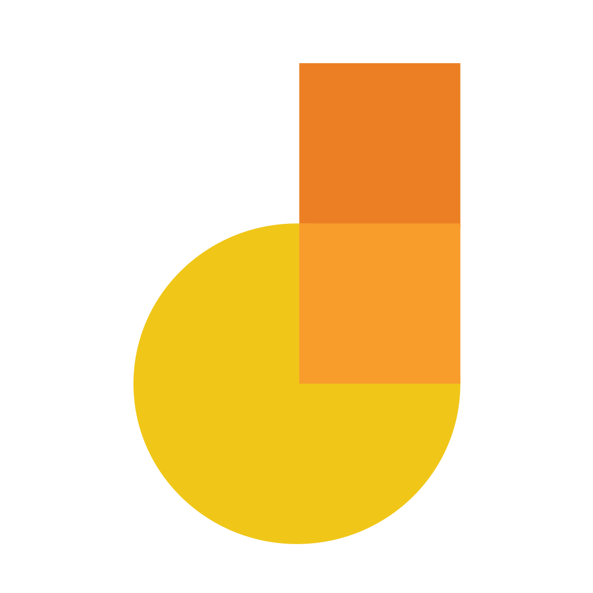

# MeasureSoftGram - 2022.01

## MeasureSoftGram

MeasureSoftGram é um software livre que almeja monitorar as métricas de qualidade de um produto de software visando fornecer métricas que ajudam na tomada de decisões.

## Por que usar o MeasureSoftGram?

O MeasureSoftGram facilita a compreensão da maturidade da qualidade de um software, uma vez que monitorar várias métricas de qualidade no decorrer do tempo. Desta forma a organização interessada no software é capaz de analisar quais pontos ainda precisam de melhorias e quando o software está maduro o suficiente para ser disponibilizado.

## Como contribuir?

<!-- TODO: Adicionar link do guia de contribuição -->
Caso você se interesse pelo projeto e queira contribuir, acesse o link do nosso [guia de contribuição](#), lá você irá encontrar todos os detalhes.

## Arquitetura do software

O software MeasureSoftGram é baseado na arquitetura de microsserviços, ou seja, o processamento é distribuído em vários módulos independentes que trabalham em conjunto para fornecer um resultado final.

Atualmente os principais módulos já visualizados são:
- [Service](https://github.com/fga-eps-mds/2021-2-MeasureSoftGram-Service): Serviço que realiza a conexão com o banco de dados e mantém o registros das métricas analisadas
- [Core](https://github.com/fga-eps-mds/2021-2-MeasureSoftGram-Core): Serviço que abstrai o modelo matemático que computa os resultados das métricas.
- [CLI](https://github.com/fga-eps-mds/2021-2-MeasureSoftGram-CLI): Aplicação de linha de comando que realiza a integração com a fonte das métricas de quailidade (hoje o json obtido na API do SonarCube).
- **Dashboard**: Aplicação web que irá apresentar as métricas de qualidade em gráficos.


Para rodar o projeto localmente siga os passos abaixo:

```
$ ???
```


## Licença

[AGPL-3.0 License](https://github.com/fga-eps-mds/2022-1-MeasureSoftGram-Doc/blob/main/LICENSE)

## Documentação

A documentação detalhada desse projeto pode ser encontrada nos seguintes repositórios:

- [Documentação da equipe do semestre 2022/01](https://github.com/fga-eps-mds/2022-1-MeasureSoftGram-Doc)
- [Documentação da equipe do semestre 2021/02](https://github.com/fga-eps-mds/2021-2-MeasureSoftGram-Doc)


## Outras informações

Para mais informações consulte a página web do projeto no [link](https://fga-eps-mds.github.io/2022-1-MeasureSoftGram-Doc)

### Colaboradores
| Disciplina | Matrícula | Nome | GitHub | E-mail |
|:--:|:--:|:--:|:--:|:--:|
| EPS | 160005191 | Durval Carvalho de Souza	| [@durvalcarvalho](https://github.com/durvalcarvalho)
| EPS | 180018604 | Hugo Sobral de Lima Salomao	| [@KiSobral](https://github.com/KiSobral)
| EPS | 180021974 | Leonardo da Silva Gomes	| [@leosilvagomes](https://github.com/leosilvagomes)
| EPS | 180114093 | Lucas Ursulino Boaventura 	| [@lboaventura25](https://github.com/lboaventura25)
| EPS | 180033034 | Hérick Ferreira de Souza Portugues	| [@herickport](https://github.com/herickport)
| EPS | 180063162 | Daniel Primo de Melo	| [@danieldagerom](https://github.com/danieldagerom)
| EPS | 170139981 | Danillo Gonçalves de Souza	| [@danillogs](https://github.com/danillogs)
| EPS | 150005563 | André Lucas Ferreira Lemos de Souza	| [@andrelucasf](https://github.com/andrelucasf)
| EPS | 160124484 | Heron Rodrigues Sousa	| [@heronsousa](https://github.com/heronsousa)
| EPS | 170164411 | Victor Amaral Cerqueira	| [@victoramaralC](https://github.com/victoramaralC)

## Ferramentas utilizadas durante o projeto

 Logo |  Nome  | Funcionalidades no projeto |
 ---- | ---- | ---- |
 |  Docsify  | O docsify é um gerador de páginas estáticas sob demanda. No nosso projeto ele foi configurado para realizar o transpilação de arquivos em Markdown para páginas HTML, foi utilizado em conjunto com o github pages. |
 |    Github    | O Github é uma excelente ferramenta para controle de versionamento e armazenamento dos arquivos de documentação. |
 | Visual Studio Code	 | Considerado por muitos como o melhor editor de códigos da atualidade, o Visual Studio Code, mais conhecido como VSCode está presente em nosso projeto como o editor de códigos principal.|
 | Google Drive	 | O Drive do Google é um excelente sistema de gerenciamento, armazenamento e compartilhamento de arquivos, foi utilizado em nosso projeto para armazenamento e compartilhamento de nossos arquivos.|
 | Telegram	 | Uma das maiores ferramentas de comunicação da atualidade, permitiu ao grupo uma excelente forma de compartilhar informações de forma ágil e facil durante todo o projeto.|
 | Youtube	 | Maior plataforma de compartilhamento de vídeos do mundo, o Youtube dispensa apresentações. Em nosso  projeto, foi utilizado para armazenar e compartilhar os vídeos de apresentação.|
 | Jamboard | Quadro branco digital e colaborativo que permite que equipes discutam ideias e salvem na nuvem para acesso em qualquer dispositivo |
 | Mural | MURAL is a tool that connects teams with a digital whiteboard and collaboration features designed to inspire innovation. |
 | ZenHub | Zenhub is a tool that helps teams get things done faster with agile automations that save time, fewer meetings, and more visibility on GitHub. |
 | Draw.io | O Draw.io é um editor gráfico online no qual é possível desenvolver desenhos, diagramas, gráficos e outros. Ele disponibiliza recursos para criação de qualquer tipo de desenho e, por ser conectado a uma conta no Google Drive, deixa as criações disponíveis para serem alteradas. Ferramenta utilizada para a criação dos fluxos da análise de tarefas.|