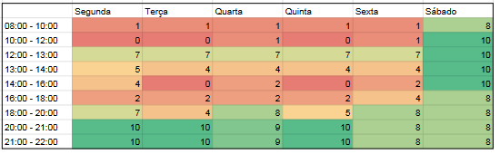

# Agenda de trabalho e ferramentas

## Histórico de versão

| Data | Autor | Descrição da revisão | Versão |
| :--: | :---: | :------------------: | :----: |
| 15 de julho de 2022 | **Heron Rodrigues** | Inclusão da documentação     | 1.0.0 |

## Objetivo do documento

Este documento visa definir como se deu a organização em relação a disponibilidade dos membros para trabalharem no desenvolvimento do projeto. Além disso, este documento apresenta as ferramentas utilizadas pela equipe para a realização das tarefas.

## Agenda de trabalho

Para estabelecer o horário de trabalho da equipe, primeiramente, foi solicitado o preenchimento de uma planilha com a disponibilidade de horário de cada membro do time. A figura a seguir apresenta a quantidade de integrantes do time disponível em cada horário:

.

Em seguida, foi definido agenda para a realização das reuniões com o cliente e demais rituais adotados pelo time:

* Toda segunda-feira das 20h às 21h00 é realizada uma reunião de ponto de controle com o cliente do projeto.

* Todas terças e quintas, por volta das 16h05 até as 16h20 serão realizadas as dailies.

Maiores detalhes relacionados a realização dessas reuniões e demais comunicações da equipe, estão descritos no documento [Plano de Comunicação](./plano_de_comunicacao.md).

## Ferramentas

Durante o desenvolvimento do projeto serão realizadas diversas tarefas, cada uma com seu objetivo específico e possuindo diferentes formas de elaboração.

A seguir, são apresentadas as aplicações utilizadas pela equipe e sua respectiva finalidade dentro do projeto.

| Ferramenta | Finalidade |
| :---: | --- |
| <strong>Discord</strong>| Utilizado para comunicação rápida com o cliente e também para as reuniões do grupo e tópicos gerais |
|  <strong>Telegram</strong> | Utilizado para comunicação interna do time, onde são debatidos horários para a realização de reuniões, enquetes para tomada de decisões, e também para discutir o andamento do projeto |
|  <strong>Teams</strong> | Ferramenta para a realização de reuniões internas do time e para encontros onlines com o cliente |
|  <strong>Google Drive</strong> | Utilizado pelo time para preenchimento de informações utilizadas internamente, como horarios de disponibilidade, conhecimento de tecnologias, entre outros. Também utilizado pelo cliente para centralizar materiais importantes relacionados ao produto (artigos, slides etc) |
|  <strong>GitHub</strong> | Utilizado para centralizar tanto o código-fonte do produto quanto documentos desenvolvidos pelo time |
|   <strong>Figma</strong> | Ferramenta utilizada para o desenvolvimento da identidade visual e dos protótipos do produto |
|  <strong>ZenHub</strong> | Utilizado para documentar a baseline de requisitos, roadmap, servir como quadro Kanban para o time e atribuições de tarefas |
|  <strong>Mural</strong> | Aplicação colaborativa utilizada pelo time e pelo cliente para o desenvolvimento dos artefatos do lean inception |