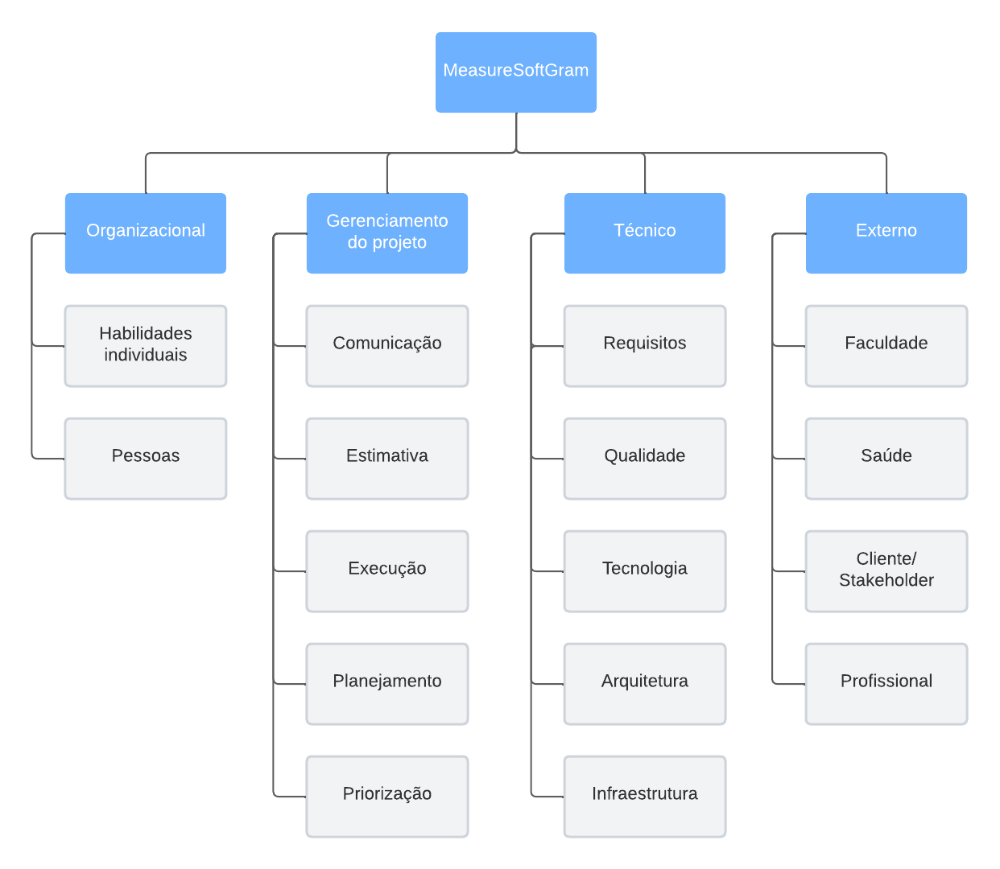

# Analise de risco

## Histórico de versão

|        Data         |       Autor        |      Descrição da revisão      | Versão |
| :-----------------: | :----------------: | :----------------------------: | :----: |
| 03 de julho de 2022 | **Danillo Souza**  |      Criação do documento      | 1.0.0  |
| 08 de julho de 2022 | **Leonardo Gomes** | Ajuste no histórico de versão  | 1.0.1  |
| 08 de julho de 2022 | **Leonardo Gomes** | Ajustes estruturais do arquivo | 1.0.2  |

## Estrutura Analítica de Riscos

Para que seja possível identificar de forma mais simples os possíveis riscos durante o projeto MeasureSoftGram durante o semestre de 2022/1, foi elaborado o diagrama da Estrutura Analítica de Riscos.

A Estrutura Analítica de Riscos (EAR) é uma ferramenta pela qual é possível agrupar os riscos e organizá-los em categorias. Cada categoria é então dividida em níveis, sendo que cada nível detalha a fonte de riscos para o projeto. Portanto, a EAR é uma estrutura hierárquica de possíveis fontes de risco.

##### Figura 1: EAR - Estrutura Analítica de Riscos

Ao analisar o diagrama pode-se extrair os seguintes possíveis riscos:

**Organizacional**:

- Habilidades individuais: Conhecimento de cada integrante em relação as tecnologias utilizadas atualmente no MeasureSoftGram.
- Priorização: Priorização de atividades pode ser realizada de forma equivocada.
- Pessoas: Risco associado a gerência de pessoas da equipe.

**Gerenciamento do projeto**:

- Comunicação: Comunicação entre os membros do time e o cliente.
- Estimativa: Estimativas que o time fará para cada tarefa durante a sprint.
- Execução: A execução do projeto em si.
- Planejamento: Planejamento para a evolução do MeasureSoftGram.

**Técnico**:

- Requisitos: Relacionado com a definição dos novos requisitos.
- Qualidade: Relacionado ao código antigo e as novas linhas desenvolvidas.
- Tecnologia: As tecnologias adotadas anteriormente e as possíveis novas que serão usadas.
- Arquitetura: Relacionado a arquitetura adotada anteriomente.
- Infraestrutra: Infraestrutura que a equipe terá que manter.

**Externo**:

- Faculdade: Outras disciplinas podem influenciar no andamento do projeto.
- Saúde: Integrantes e cliente podem adoecer durante o semestre. Também a o risco de alguem contrair COVID-19 e as aulas tornarsem remotas, por um perído, novamente.
- Cliente/Stakeholder: Cliente pode não está sempre dísponivel.
- Profissional: Vida profissional pode afetar o ritmo e hórarios dos estudantes.

## Refêrencia

[1] TERLIZZI, Marco Alexandre; BIANCOLINO, César Augusto. Estrutura Analítica de Riscos em Projetos de Desenvolvimento de Software no Setor Bancário: Um Estudo Exploratório. Revista Gestão & Tecnologia, [S. l.], p. 51-78, 1 maio 2014. Disponível em: revistagt.fpl.emnuvens.com.br/get/article/viewFile/628/534. Acesso em: 3 jul. 2022.
