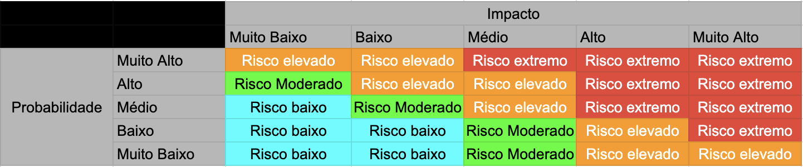

# Análise de Risco

## Histórico de versão

|        Data         |       Autor        |        Descrição da revisão         | Versão |
| :-----------------: | :----------------: | :---------------------------------: | :----: |
| 03 de julho de 2022 | **Danillo Souza**  |        Criação do documento         | 1.0.0  |
| 08 de julho de 2022 | **Leonardo Gomes** |    Ajuste no histórico de versão    | 1.0.1  |
| 08 de julho de 2022 | **Leonardo Gomes** |   Ajustes estruturais do arquivo    | 1.0.2  |
| 11 de julho de 2022 | **Danillo Souza**  |     Adicionado matriz de risco      | 1.0.3  |
| 11 de julho de 2022 | **Danillo Souza**  |    Adicionado planilha de risco     | 1.0.4  |
| 12 de julho de 2022 |  **Hugo Sobral**   |  Proposta de melhoria do documento  | 1.0.5  |
| 12 de julho de 2022 | **Leonardo Gomes** | Ajustes textuais e impacto de risco | 1.0.6  |
| 05 de setembro de 2022 | **Hérick Portugues** | Adição da análise quantitativa e dos gráficos de gerenciamento dos riscos | 2.0.0  |

## Estrutura Analítica de Riscos

Para que seja possível identificar de forma mais simples os possíveis riscos do projeto MeasureSoftGram durante o semestre de 2022/1, foi elaborado o diagrama da Estrutura Analítica de Riscos.

A Estrutura Analítica de Riscos (EAR) é uma ferramenta pela qual é possível agrupar os riscos e organizá-los em categorias. Cada categoria é então dividida em níveis, sendo que cada nível detalha a fonte de riscos para o projeto. Portanto, a EAR é uma estrutura hierárquica de possíveis fontes de risco.


##### Figura 1: EAR - Estrutura Analítica de Riscos

Ao analisar o diagrama pode-se extrair os seguintes possíveis riscos:

**Organizacional**:

- Habilidades individuais: Conhecimento de cada integrante em relação as tecnologias utilizadas atualmente no MeasureSoftGram.
- Pessoas: Risco associado a gerência de pessoas da equipe.

**Gerenciamento do projeto**:

- Comunicação: Comunicação entre os membros do time e o cliente.
- Estimativa: Estimativas que o time fará para cada tarefa durante a sprint.
- Execução: A execução do projeto em si.
- Planejamento: Planejamento para a evolução do MeasureSoftGram.
- Priorização: Priorização de atividades pode ser realizada de forma equivocada.

**Técnico**:

- Requisitos: Relacionado com a definição dos novos requisitos.
- Qualidade: Relacionado ao código antigo e as novas linhas desenvolvidas.
- Tecnologia: As tecnologias adotadas anteriormente e as possíveis novas que serão usadas.
- Arquitetura: Relacionado a arquitetura adotada anteriomente.
- Infraestrutra: Infraestrutura que a equipe terá que manter.

**Externo**:

- Faculdade: Outras disciplinas podem influenciar no andamento do projeto.
- Saúde: Integrantes e cliente podem adoecer durante o semestre. Também a o risco de alguem contrair COVID-19 e as aulas tornarsem remotas, por um perído, novamente.
- Cliente/Stakeholder: Cliente pode não está sempre dísponivel.
- Profissional: Vida profissional pode afetar o ritmo e hórarios dos estudantes.

## Análise Quantitativa

### Probabilidade
**Probabilidade** | **Intervalo** | **Peso**
:---------------: | :-----------: | :------:
**Muito Alta**    |   81 a 100    |    5
**Alta**          |   61 a 80     |    4
**Média**         |   41 a 60     |    3
**Baixa**         |   21 a 40     |    2
**Muito Baixa**   |   0 a 20      |    1

### Impacto
Para se quantificar o impacto do risco no projeto o custo, o tempo, o escopo e a qualidade devem ser levados em conta.

**Impacto**       |                     **Descrição**                      | **Peso**
:---------------: | :----------------------------------------------------: | :------:
**Muito Alto**    | O impacto inviabiliza o projeto                        |    5
**Alto**          | Há grande impacto no desenvolvimento do projeto        |    4
**Médio**         | Possui certo impacto porém é facilmente recuperado     |    3
**Baixo**         | Pouco impacto no desenvolvimento do projeto            |    2
**Muito Baixo**   | Impacto pouco expressivo no desenvolvimento do projeto |    1

### Prioridade
Através da multiplicação entre as estimativas de impacto e probabilidade é possível calcular a prioridade dos riscos. A partir desses valores é determinada a urgência da inicialização de medidas de mitigação e resolução dos riscos.

**Probabilidade x Impacto** | **Muito Baixo** | **Baixo** | **Médio**  | **Alto** | **Muito Alto**
:-----------------------: | :-------------: | :-------: |:----------:|:--------:|:------------: 
**Muito Alta**            |        5        |    10     |      15    |    20    |      25
**Alta**                  |        4        |    8      |      12    |    16    |      20
**Média**                 |        3        |    6      |      9     |    12    |      15
**Baixa**                 |        2        |    4      |      6     |    8     |      10
**Muito Baixa**           |        1        |    2      |      3     |    4     |      5

## Matriz de Risco

De acordo com a prioridade dos riscos, foi desenvolvida a matriz de risco a seguir:



## Planilha de Riscos

Para cada uma das fontes de riscos definidas na EAR (Organizacional, Externo, Gerenciamento de projeto e Técnico), foram levantados riscos para a realização do projeto. Cada risco da planilha conta com a probabilidade e impacto no início do projeto, além da prevenção e plano de ação. Abaixo de cada tabela, há o gráfico com o gerenciamento de cada um dos riscos (identificados pelo ID) durante as sprints* do projeto. 

```* O gerenciamento dos riscos começou a ser realizado a partir da Sprint 5.```

**Organizacional**:

| ID  | Risco                                                                             | Probabilidade | Impacto | Prevenção                                               | Plano de ação                                                                                                                                                  |
| --- | --------------------------------------------------------------------------------- | ------------- | ------- | ------------------------------------------------------- | -------------------------------------------------------------------------------------------------------------------------------------------------------------- |
| R1  | Integrantes podem não estar familiarizados com as tecnologias adotadas no projeto | Baixo         | Alto    | Treinar integrantes não familiarizados com a tecnologia | Incentivar treinamentos e tarefas pareadas                                                                                                                     |
| R2  | Realizar pareamentos de forma ineficiente                                         | Médio         | Alto    | Conhecer as habilidades dos membros da equipe           | O time deve realizar pareamentos de uma forma que seja benéfica à equipe. Pelo menos um dos integrantes do pareamento deve ter mais experiência com o problema |
| R3  | Atividades podem ser indicadas de forma equivocada                                | Baixo         | Alto    | Conhecer as habilidades dos membros da equipe           | Criar um quadro de conhecimento para saber a especialidade de cada integrante.                                                                                 |

<iframe src="https://docs.google.com/spreadsheets/d/e/2PACX-1vSRNmajBsenuYzDO-3k0z0XIlA1UhBFF1FvxeuyMJThBsKcoyy4jSER5JkrHJf700FhHcpBohI3SO3b/pubhtml?gid=1768542007&amp;single=true&amp;widget=true&amp;headers=false" height="500px"></iframe>

**Externo**:

| ID  | Risco                                                                                               | Probabilidade | Impacto | Prevenção | Plano de ação                                                                         |
| --- | --------------------------------------------------------------------------------------------------- | ------------- | ------- | --------- | ------------------------------------------------------------------------------------- |
| R4  | Indisponibilidade do cliente ao decorrer do projeto                                                 | Alto          | Alto    | -         | Sempre que for possível ou necessário, obter o máximo de informação do cliente assim. |
| R5  | Algum integrante do time pode ficar indisponível                                                    | Alto          | Médio   | -         | Adaptar trabalho do time quando houver necessidade                                    |
| R6  | Demandas na vida profissional e faculdade dos integrantes do time podem afetar andamento do projeto | Alto          | Baixo   | -         | Time deve planejar bem seus horários e disponibilidades                               |

<iframe src="https://docs.google.com/spreadsheets/d/e/2PACX-1vSRNmajBsenuYzDO-3k0z0XIlA1UhBFF1FvxeuyMJThBsKcoyy4jSER5JkrHJf700FhHcpBohI3SO3b/pubhtml?gid=1194146969&amp;single=true&amp;widget=true&amp;headers=false" height="500px"></iframe>

**Gerenciamento de projeto**:

| ID  | Risco                                                                       | Probabilidade | Impacto | Prevenção                                                                                                 | Plano de ação                                                                                                                         |
| --- | --------------------------------------------------------------------------- | ------------- | ------- | --------------------------------------------------------------------------------------------------------- | ------------------------------------------------------------------------------------------------------------------------------------- |
| R7  | Alguns integrantes podem acabar perdendo reuniões e informações importantes | Médio         | Baixo   | Identificar horários de disponibilidade de integrantes do grupo                                           | Realizar reuniões rápidas, pelo menos duas vezes por semana, para alinhar time, além disso criar resumo de reuniões longas no Github. |
| R8  | É possível que tarefas sejam estimadas de forma equivocada                  | Baixo         | Alto    | Durante a fase de planejamento, identificar tarefas que sejam muito complexas.                            | Quebrar tarefas muito grandes, ou complexas, em várias pequenas tarefas que tornam o desenvolvimento mais fácil.                      |
| R9  | Muitas tarefas podem acabar indo para a priorizadas e se tornem dívidas     | Alto          | Baixo   | Avaliar as métricas que o Zenhub fornece ao time, dessa forma evitaremos possíveis dívidas técnicas       | Planejar sprints baseado em métricas passadas da equipe.                                                                              |
| R10 | Atrasar execução de uma tarefa                                              | Alto          | Baixo   | Desenvolvedor deve informar a equipe do problema que está ocorrendo para que todos saibam do que se trata | Realizar pareamentos, dessa forma é possível que a tarefa seja entregue de forma mais rápida.                                         |
| R11 | Priorização de tarefas de forma equivocada                                  | Alto          | Baixo   | Validar com o cliente as tarefas que deve ser priorizadas                                             | Realizar planning meetings         
| R12 | Falta de engajamento de membros do grupo                                    | Alto          | Alto    | Realizar reuniões e motivar todos do grupo na realização do projeto                                   | Caso necessário, entregar tarefas "não blocantes" para membros menos engajados |

<iframe src="https://docs.google.com/spreadsheets/d/e/2PACX-1vSRNmajBsenuYzDO-3k0z0XIlA1UhBFF1FvxeuyMJThBsKcoyy4jSER5JkrHJf700FhHcpBohI3SO3b/pubhtml?gid=993723594&amp;single=true&amp;widget=true&amp;headers=false" height="550px"></iframe>

**Tecnico**:

| ID  | Risco                                                                                        | Probabilidade | Impacto    | Prevenção                                                 | Plano de ação                                                                              |
| --- | -------------------------------------------------------------------------------------------- | ------------- | ---------- | --------------------------------------------------------- | ------------------------------------------------------------------------------------------ |
| R13 | Arquitetura definida previamente pode não atender requisitos para mutabilidade do produto    | Alto          | Muito Alto | Analisar documento arquitetural e implementação no código | Alterar arquitetura para atender novos requisitos e, se necessário, replanejar arquitetura |
| R14 | Infraestrutura definida previamente deverá ser alterada por não atender requisitos           | Baixo         | Muito Alto | Entender bem sobre a infra estrutura que será utilizada   | Alterar infraestrutura                                                                     |
| R15 | Qualidade do código já escrito pode estar ruim (Code smell, alto acoplamento e baixa coesão) | Alto          | Alto       | Analisar código e entender sua lógica                     | Refatorar o código aos poucos quando for necessário                                        |
| R16 | Requisitos para nova MVP podem ser definidos de forma equivocada                             | Baixo         | Alto       | Sempre que possível, validar requisitos com o cliente     | Criar fluxo de criação, refinamento e validação de requisitos.                             |
| R17 | Priorizar etapas, requisitos ou atributos de qualidade de forma equivocada                   | Baixo         | Muito Alto | Validar dúvidas com o cliente                             | Despriorizar tudo que não for necessário                                                   |
| R18 | Tecnologia definida pode não atender requisitos do projeto                                   | Baixo         | Muito Alto | Enteder capacidade das tecnologias utilizadas             | Caso haja algum problema muito grande, estudar novas tecnologias e aplicá-las              |
| R19 | Requisitos do MVP podem não ser finalizados no prazo definido                                | Alto          | Muito Alto | Manter conversas frequentes com o cliente, validando os requisitos do MVP  | Caso seja necessário, reduzir e repriorizar os requisitos do MVP, para manter a entrega |

<iframe src="https://docs.google.com/spreadsheets/d/e/2PACX-1vSRNmajBsenuYzDO-3k0z0XIlA1UhBFF1FvxeuyMJThBsKcoyy4jSER5JkrHJf700FhHcpBohI3SO3b/pubhtml?gid=1173093087&amp;single=true&amp;widget=true&amp;headers=false" height="570px"></iframe>

## Refêrencia

[1] TERLIZZI, Marco Alexandre; BIANCOLINO, César Augusto. Estrutura Analítica de Riscos em Projetos de Desenvolvimento de Software no Setor Bancário: Um Estudo Exploratório. Revista Gestão & Tecnologia, [S. l.], p. 51-78, 1 maio 2014. Disponível em: revistagt.fpl.emnuvens.com.br/get/article/viewFile/628/534. Acesso em: 3 jul. 2022.

[2] VARGAS, Ricardo; Elaborando a Estrutura Analítica do Projeto (EAP/WBS) - Videocast. Disponível em: https://ricardo-vargas.com/pt/videos/videocast-preparing-the-work-breakdown-structure-wbs/. Acesso em: 3 jul. 2022.

[3] GHERMANDI, Filippo; Como usar a matriz de riscos no gerenciamento de projetos?. Disponível em: https://academiadoconsultor.com.br/como-usar-a-matriz-de-riscos-no-gerenciamento-de-projetos. Acesso em 10 jul. 2022.

[4] WIKI Multilind. Plano de Análise de Riscos. Disponível em: https://fga-eps-mds.github.io/2021.1-Multilind-Docs/#/Project/analiseRiscos. Acesso em: 04 de set. de 2022

[5] WIKI Stay Safe. Plano de Gerenciamento de Risco. Disponível em: https://fga-eps-mds.github.io/2020.1-stay-safe-docs/projeto/risk-management/. Acesso em: 05 de set. de 2022
