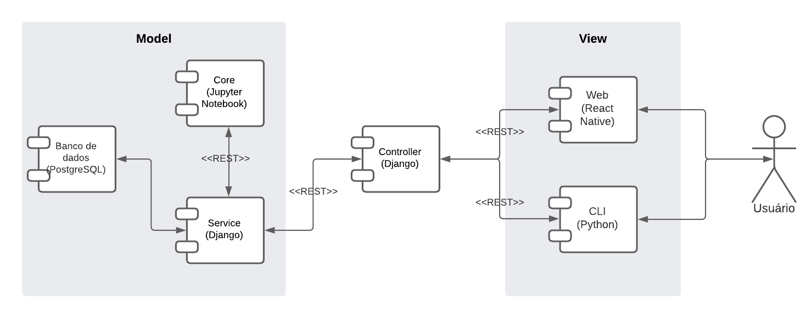

# Documento arquitetural

|        Data         |       Autor       |       Descrição da revisão        | Versão |
| :-----------------: | :---------------: | :-------------------------------: | :----: |
| 12 de julho de 2022 | **Danillo Souza** |     Inclusão da documentação      | 0.1.0  |
| 12 de julho de 2022 | **Danillo Souza** | Inclusão do diagrama arquitetural | 0.2.0  |

## Introdução

A finalidade deste documento é detalhar as decisões arquiteturais do MeasureSoftGram utilizando diferentes visões arquiteturais, a fim de facilitar o entendimento dos processos envolvidos no desenvolvimento e todo o funcionamento do produto e além disso dar atualizar a [documentação original](https://fga-eps-mds.github.io/2021-2-MeasureSoftGram-Doc/docs/artifact/sad) do projeto.
Nesse documento, estão descritos os componentes, tecnologias e diferentes visões arquiteturais do MeasureSoftGram.

## Diagrama arquitetural

## Referência

[1] MARIOTTI,Flávio Secchieri; Como documentar a Arquitetura de Software. Disponível em: http://www.linhadecodigo.com.br/artigo/3343/como-documentar-a-arquitetura-de-software.aspx. Acessado em: 12/07/2022.
