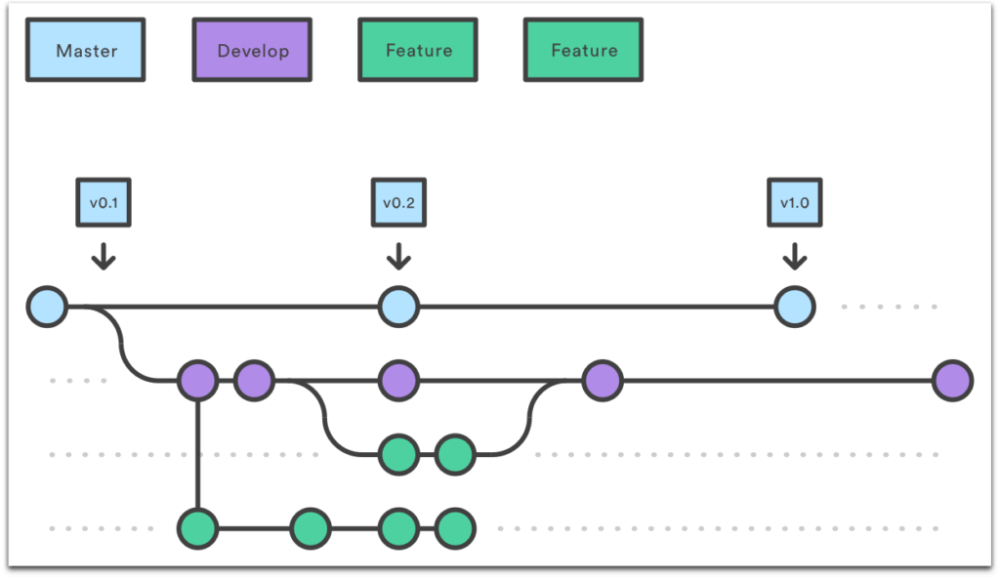

# Gerência de Configuração
## Histórico de versão
| Data | Versão | Modificação | Autor |
| ---- | ------ | ----------- | ----- |
| 01/07/2022 | 0.1 | Criação do documento | Hugo Sobral |
| 02/07/2022 | 0.2 | Adição do tópico de revisão de código | Hugo Sobral |

## Introdução
Este documento tem como objetivo definir e esclarecer quais vão ser as práticas de gerência de configuração adotada para o projeto. Entende-se como gerência de configuração não apenas o sistema de controle de versão utilizado, que em termos práticos será o ```git```, mas também todo o conjunto de práticas e políticas para gerenciar as diversas versões do sistema.

## Versionamento semântico
Entende-se como versionamento semântico as práticas adotadas para a identificação das diferentes releases de um determinado sistema. Para o MeasureSoftGram, utilizamos o formato ```X.Y.Z```, onde ```X```, ```Y``` e ```Z``` são números inteiros.

Os números em ```Z``` sofrem incrementos toda vez que uma nova release é lançada com apenas correções de bugs. Estas atualizações são chamadas de **Patch**.

Os números em ```Y``` sofrem incrementos toda vez que uma nova release que contenha pequenas funcionalidades é lançada. Estas atualizações recebem o nome de **Release Minor**.

Os números em ```X``` sofrem incrementos toda vez que uma nova release com funcionalidades muito diferentes da anterior é lançada. Estas atualizações englobam funcionalidades mais robustas para o produto e recebem o nome de **Release Major**.


## Fluxo de Trabalho
Para o fluxo de trabalho adotado pela equipe, utilizaremos o **gitflow**, também conhecido como **git workflow**. O **gitflow** é um fluxo de trabalho para padronização e definição de responsabilidades de branches. O gitflow mostra seu valor quando utilizado em projetos com a necessidade da paralelização do trabalho, isto é, quando é necessário que várias pessoas implementem várias partes do código dentro de uma mesma iteração de desenvolvimento.


##### Figura 1: Exemplo de fluxo de branches no gitflow

Como exemplificado na figura acima, temos um fluxo de trabalho centralizado nas branches **main** e **develop**. A branch main fica responsável por manter o código estável do projeto enquanto a branch develop recebe as atualizações provenientes das branches de **feature** e de **bugfix**. Caso seja necessária a atualização de algum defeito mapeado diretamente na main, são criadas branches de **hotfix** para correções rápidas e menos burocráticas.

A branch ```main```: esta é a branch principal do projeto. Nesta branch estão contidas as **Releases major** e os **Patches** do projeto. Para que um código chegue até a branch main, este deve antes estar estável.

A branch ```develop```: é uma branch criada a partir a partir da branch **main**. A **develop** contém as **Releases minor** do projeto. Juntamente das branches de **hotfix**, a **develop** é a única branch que mantém contato com a **main**.

Branches de ```hotfix```: são criadas a partir da **main** e são utilizadas para correções de defeitos e inconsistências mapeadas na main. As branches de **hotfix** não precisam passar pela develop antes de serem integradas à main.

Branches de ```feature```: são criadas a partir da **develop** e ocorrem em cada iteração de desenvolvimento. as branches de feature englobam todas as atividades relacionadas com um determinado requisito elicitado ao projeto. Uma vez que uma branch de feature é finalizada, está é integrada com a branch develop.

Branches de ```task```: são criadas a partir das **feature** e englobam uma atividade técnica específica relacionada a um determinado requisito do projeto. Uma vez que uma branch de task é finalizada, esta é integrada com a branch de feature relacionada a mesma.

Branches de ```bugfix```: são criadas a partir da **develop** e são utilizadas para correções e melhorias planejadas para o projeto. As branches de **bugfix**, neste caso, precisam passar pela develop antes de serem integradas à main.

## Política de Branches
Para a nomeação das branches, serão utilizados os números das issues relacionadas à branch no repositório do github. Como as branches **main** e **develop** são fixas, estes serão os nomes das mesmas.

Para branches de **hotfix**, adotaremos o padrão:
```
hotfix-000-nome_do_hotfix
```
Onde ```000``` representa o número da issue e ```nome_do_hotfix``` representa o nome do hotfix escrito em snake case.

<br/>

Para branches de **bugfix**, adotaremos o padrão:
```
bugfix-000-nome_do_bugfix
```
Onde ```000``` representa o número da issue e ```nome_do_bugfix``` representa o nome do bugfix escrito em snake case.

<br/>

Para branches de **feature**, adotaremos o padrão:
```
feat-000/nome_da_feature
```
Onde ```000``` representa o número da issue e ```nome_da_feature``` representa o nome da feature escrito em snake case. É também preciso constatar que features, para este padrão, serão representada por histórias de usuário

<br/>

Para branches de **task**, adotaremos o padrão:
```
feat-000/task-111-nome_da_task
```
Onde ```000``` representa o número da issue da feature, ```111``` representa o número da issue da tarefa técnica, e, por fim, ```nome_da_task``` representa o nome da tarefa técnica escrito em snake case. É também preciso constatar que features, para este padrão, serão representada por histórias de usuário.

## Política de Commits
Commits devem sempre referenciar a issue que estão relacionados, portanto, todo commit deve adotar o padrão
```
#000 - mensagem do commit.
```
Em que ```000``` representa o número da issue relacionada e ```mensagem do commit``` se refere a mensagem do commit escrita em português, sem acentos e no infinitivo. É importante ressaltar que o número escrito no commit, para branches de task, devem adotar o número da tarefa técnica relacionada e não da história de usuário.

## Política de Revisão de Código
Para que um código seja submetida à branch **develop** ou então à **main**, este antes deve passar por uma triagem de revisão de código para que seja garantida a consistência do projeto.

No entanto, existe uma sequência pragmática de atividades que deve ser seguida para a revisão do código. Uma vez que uma alteração é feita em branches de **task** ou de **feature**, o código é submetido, pelo **contribuidor**, a revisão de código. Para o caso do MeasureSoftGram, a revisão de código é feita por meio dos recursos disponibilizados pelo **Github**, o **Pull Request**.

Uma vez que um Pull Request é aberto pelo **contribuidor**, uma outra pessoa do time deve ficar responsável pela revisão do código e assume o papel do **revisor**. Caso seja necessário, o revisor aponta mudanças que devem ser realizadas pelo contribuidor. Uma vez que o contribuidor faz as correções apontadas no Pull Request, o revisor volta ao trabalho de revisão e, caso tudo esteja íntegro e consiste, o revisor aprova o **Pull Request** e efetua o merge.

## Referências
[1] VALENTE, M. T. Introdução. *In*: VALENTE, M. T. Engenharia de Software Moderna: Princípios e Práticas para Desenvolvimento de Software com Produtividade. 2020. Disponível em: https://engsoftmoderna.info/cap1.html. Acesso em 01/07/2022.
[2] MANSI. Introduction to Gitflow. Knóldus, 2021. Disponível em: https://blog.knoldus.com/introduction-to-git-flow/#:~:text=Git%20Flow%20is%20an%20abstract,framework%20for%20managing%20larger%20projects. Acesso em 01/07/2022.