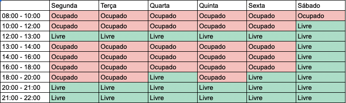
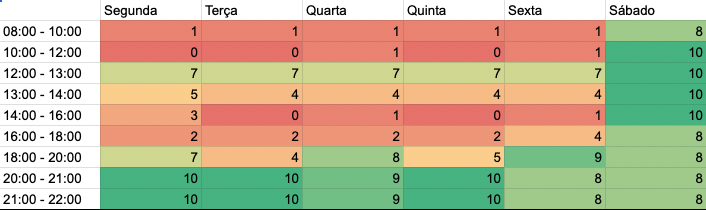
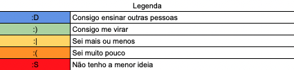
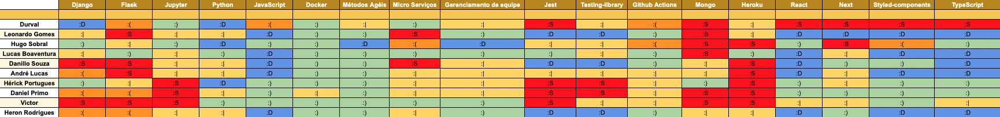
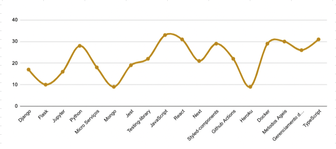

# Informações gerais da equipe

## Histórico de versão

|        Data         |       Autor        |          Descrição da revisão          | Versão |
| :-----------------: | :----------------: | :------------------------------------: | :----: |
| 08 de julho de 2022 | **Leonardo Gomes** |        Inclusão da documentação        | 1.0.0  |
| 08 de julho de 2022 | **Leonardo Gomes** | Capitalização dos titulos no documento | 1.0.1  |

## Objetivo do Documento

Este documento tem como objetivo registrar as informações coletadas sobre a equipe durante o período letivo de 2022 primeiro semestre da Universidade de Brasília, a fim de poder ser usado como insumo para definição de outros artefatos e decisões a respeito do projeto.

## Heatmap de Horário

Heatmap é um mapa de calor, que define a disponibilidade de horários pré estabelecido para haver uma facilidade no agendamento de encontros pela equipe. Para a criação deste documento, foi utilizado o Google Sheets, tendo em vista a facilidade de compartilhamento e as ferramentas nele oferecidas.

Para a execução dessa atividade, cada membro da equipe precisou responder um quadro de horário para cada horário como "Livre", se houvesse disponibilidade, e "Ocupado", para quando não houvesse disponibilidades.

##### Figura 1: Exemplo de quadro de horário que cada membro da equipe teve que responder

Após os quadros serem preenchidos, é gerado o heatmap, onde as cores quentes representam os dias menos propensos para encontros e as cores frias os dias mais propensos.

##### Figura 2: Heatmap de horário da equipe

## Quadro de Conhecimento

O quadro de conhecimento se propõe a esclarecer o entendimento de cada membro sobre _soft_ e _hard skills_ pré estabelecidas pela própria equipe. Foi utilizado o Google Sheets com o intuito de facilitar o compartilhamento do arquivo. Após estabelecer os conhecimentos que devem ser explorados nesta atividade, cada membro deve se auto avaliar e preencher o quadro com as seguintes informações:

##### Figura 3: Legenda utilizada para facilidar o preenchimento do quadro de conhecimento

Após todos os membro preencher o quadro, o mesmo nos mostra informações sobre o entendimento individual e coletivo de tecnolgias e habilidades, podendo ser usado para ajudar em escolhas futuras e delegar funções de forma mais acertiva.

##### Figura 4: Resultado do quadro de conhecimento da equipe

Além do próprio quadro, foi gerado um gráfico com as informações de conhecimento da equipe com o propósito de melhorar a visualização e o entendimento sobre os resultados gerados.

##### Figura 5: Resultado do quadro de conhecimento da equipe
