# Visão de Produto

| Data | Autor | Descrição da revisão | Versão |
| :--: | :---: | :------------------: | :----: |
| 21 de julho de 2022 | **André Lucas** | Criação do documento | 1.0.0 |

## Introdução

Para entender melhor a visão de produto necessária para o desenvolvimento do projeto, utilizamos o método Lean Inception de Paulo Carolli. Se trata de workshop colaborativo para alinhar a equipe sobre o produto mínimo viável a ser construído. Com isso seguimos as seguintes etapas.

## Quebra gelo da equipe

As dinâmicas de quebrar gelo funcionam para conhecer os participantes, mas também para deixá-los mais relaxados e confortáveis para participarem da reunião ativamente. 

As imagens abaixo mostram um pouco de como foi a nossa dinâmica.

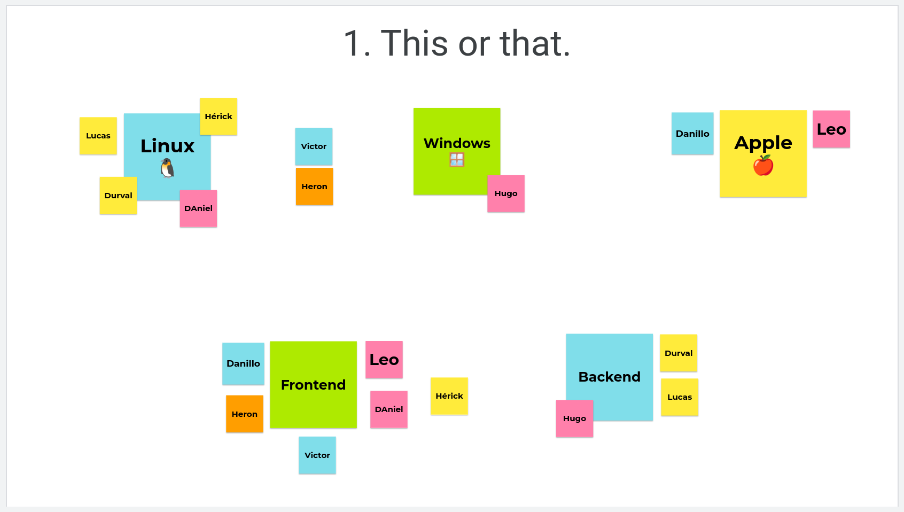
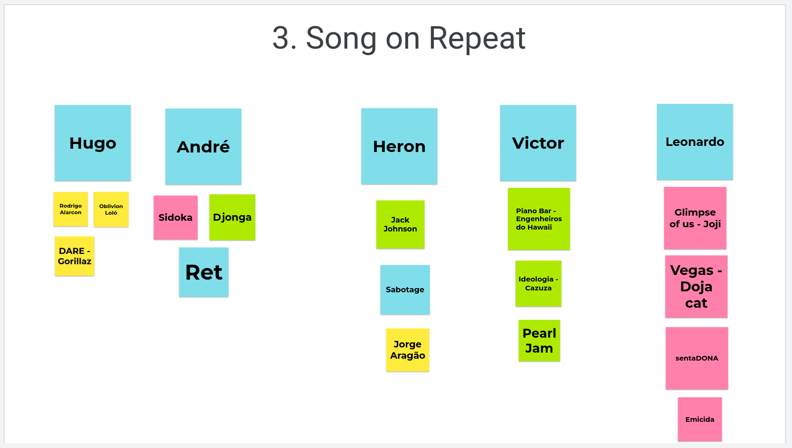

Realizada no dia 20/06/22, via Teams, e durou cerca de 30 minutos. Todos os integrantes participaram.

## Kickoff e Agenda

O Kickoff é uma reunião realizada na fase inicial de um projeto com o intuito de alinhar todos os detalhes entre os envolvidos, o cliente e os membros da equipe, por exemplo.

Nossa reunião foi gravada e está disponível nesse [link](https://drive.google.com/file/d/1VZSlDZBgwmhGET2e1AMqN1vxYKjn_gie/view?usp=sharing), nessa etapa foi apresentado o projeto e o propósito principal para que assim pudesse ser definido o objetivo final a ser alcançado.

Realizada no dia 20/06/22, via Teams, e durou cerca de 30 minutos. Todos os integrantes participaram.

## O Produto É - Não é - Faz - Não Faz

O objetivo desta atividade é determinar a classificação de um produto, ajudar a determinar suas limitações e o que consideraremos ao desenvolvê-lo.

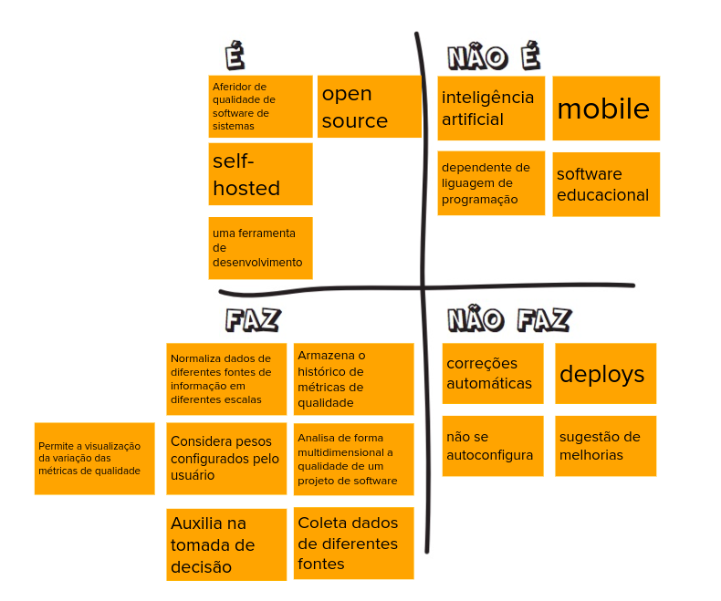

## Visão do Produto

A partir do que foi apresentado, a equipe se reuniu e desenvolveu a seguinte visão de produto:

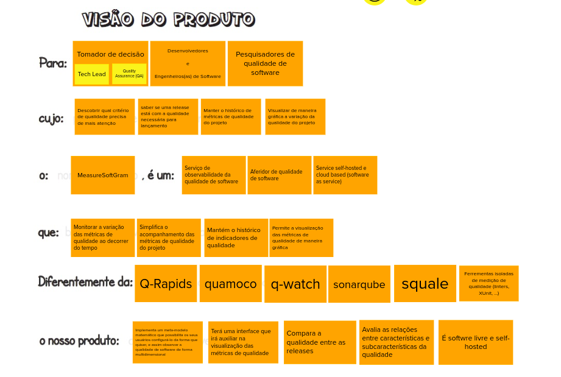

Realizada no dia 20/06/22, via Teams, e durou cerca de 30 minutos. Todos os integrantes participaram.

## Objetivos do Produto

Esta atividade auxilia no levantamento e esclarecimento dos problemas de acordo com os objetivos gerais do negócio.

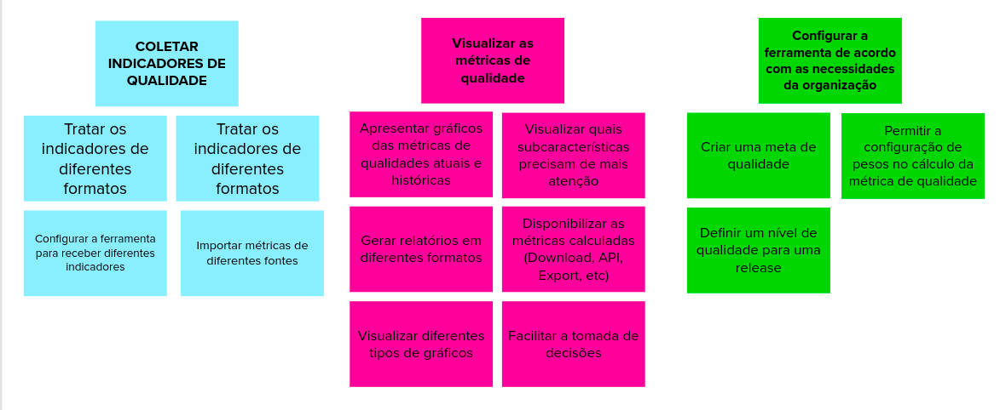

## Personas

Nesta etapa foram identificadas 4 personas de usuários para a aplicação. Mantivemos as 3 primeiras personas definidas por equipes dos semestres anteriores e adicionamos uma nova persona.

- Usuário 1: Pesquisador na área de qualidade de software

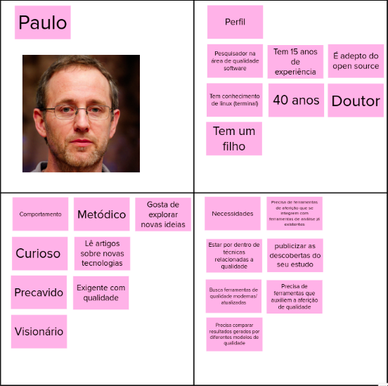

- Usuário 2: Profissional de Engenharia de Software

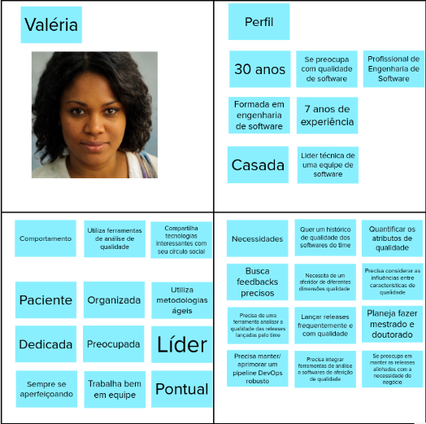

- Usuário 3: Desenvolvedor, entusiasta de IA

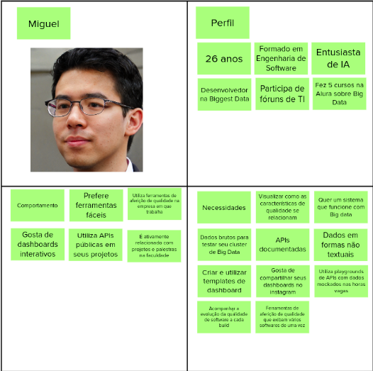

- Usuário 4: Estudante de TI

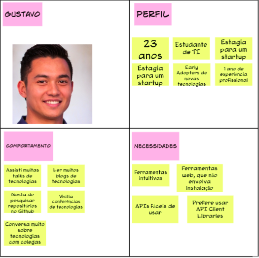

## Jornadas de Usuário

De acordo com cada persona, foi gerada a respectiva jornada do usuário:

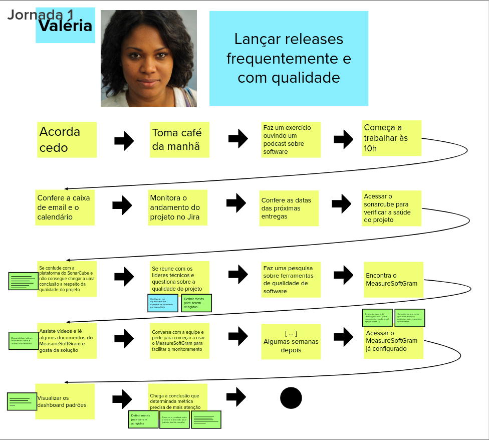
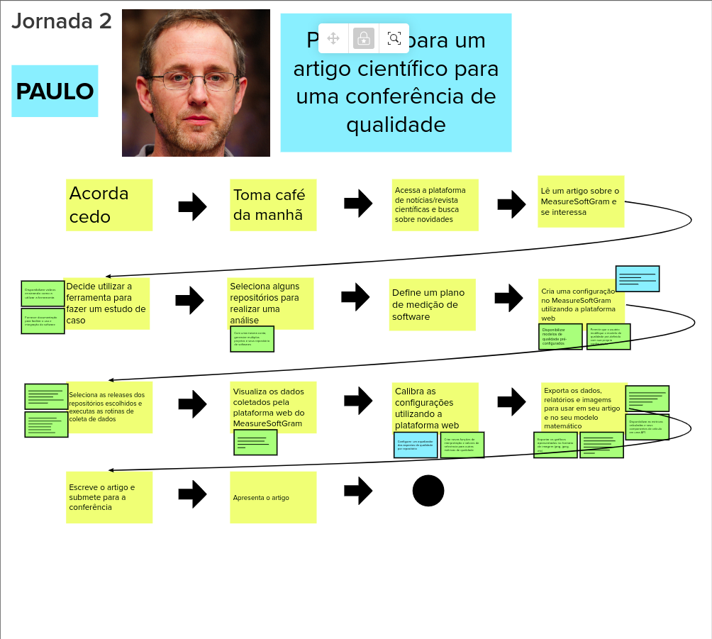
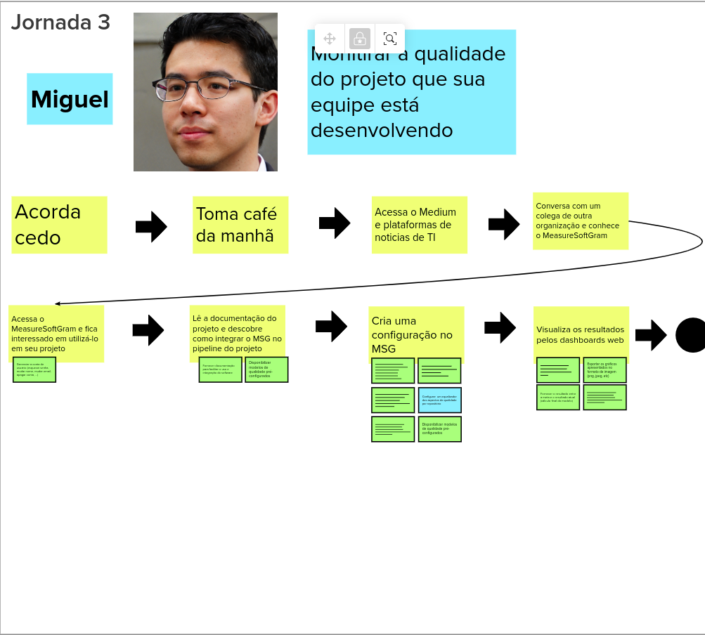

## Brainstorm de Funcionalidades

Esta atividade segue o nosso refinamento do produto criado anteriormente, lista de alvos e personas.
Dessa forma, visa descobrir as funções necessárias para atender os objetivos acima e as necessidades dos usuários representados pelos papéis.

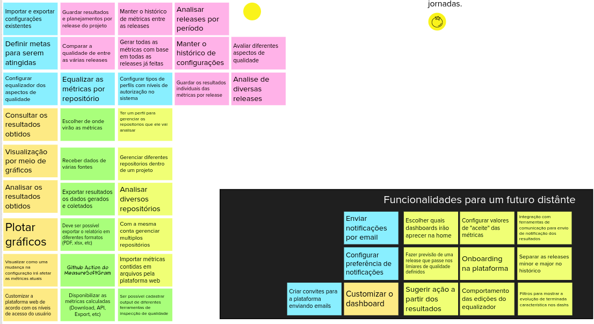

## Revisão Técnica (Esforço, Negócio, UX)

Esta atividade visa elaborar, reavaliar e normalizar vários recursos propostos durante o brainstorming de recursos, bem como descartar recursos que não fazem sentido para executar neste momento.

Foram realizadas várias reuniões para a definição deste artefato. 

A primeira foi realizada no dia 05/07/22, via Teams, e durou cerca de 1 hora e 30 minutos. Participantes: Daniel Primo de Melo, Durval Carvalho de Souza, Hugo Sobral, Lucas Boaventura, Victor Amaral Cerqueira, Danillo Gonçalves de Souza, Heron Rodrigues Sousa.

A segunda foi realizada no dia 06/07/22, via Teams, e durou cerca de 1 hora e 40 minutos. Participantes: Durval Carvalho de Souza, Hugo Sobral, Victor Amaral Cerqueira, Heron Rodrigues Sousa, Herick Ferreira de Souza, Leonardo da Silva Gomes.

A terceira foi realizada no dia 07/07/22, via Teams, e durou cerca de 1 hora e 50 minutos. Participantes: Durval Carvalho de Souza, Hugo Sobral, Leonardo da Silva Gomes, Lucas Boaventura, Daniel Primo, Andre Lucas Ferreira, Danillo Gonçalves.

## Sequenciador

Esta atividade auxilia na organização e visualizãção das funcionalidades e da sequência de validação incremental do produto.

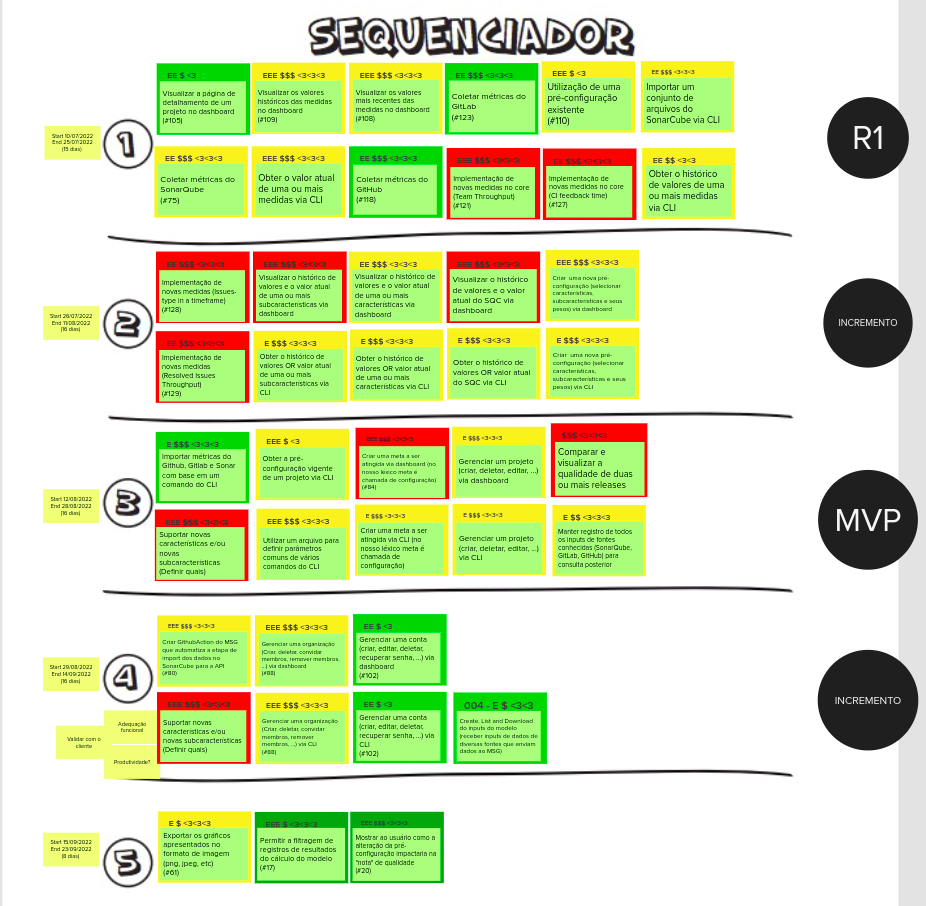

Realizada no dia 11/07/22, via Teams, e durou cerca de 1 hora e 20 minutos. Participantes: Durval Carvalho de Souza, Hugo Sobral, Leonardo da Silva Gomes, Lucas Boaventura, Hérick Portugues, Heron Rodrigues.

## Canva MVP

O Canvas MVP é um quadro visual que auxilia a equipe a alinhar e definir a estratégia do MVP.

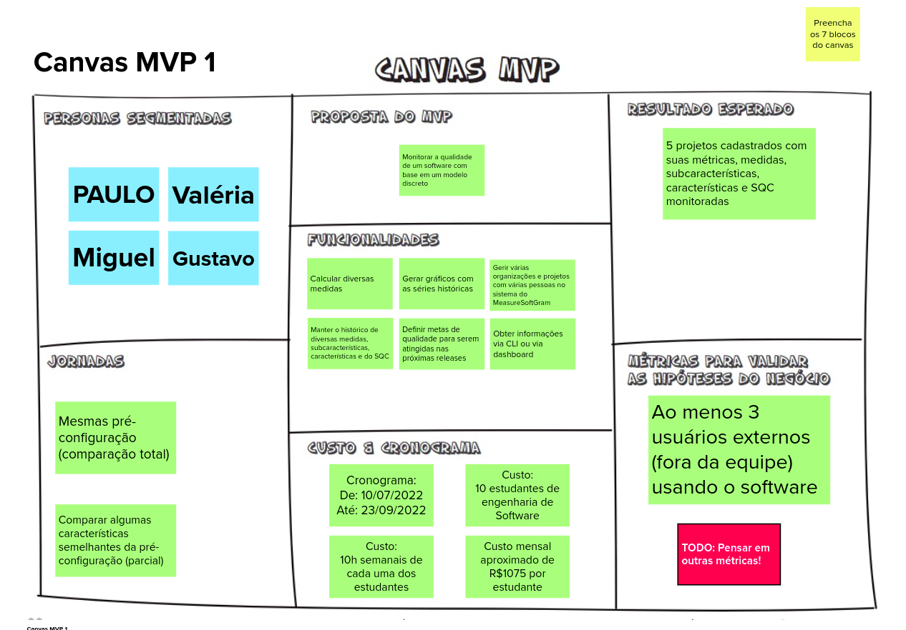

## Referência

CAROLI, Paulo. Lean Inception: How to Align People and Build the Right Product. 1 ed. São Paulo: Caroli, 2018.